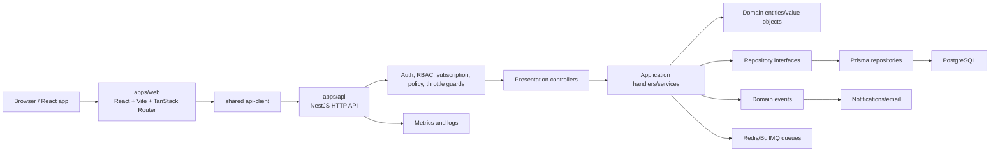

# SaaS Template Architecture And Features

This document explains the current `create-vyllion-saas` repository and the SaaS project it generates.

The repository has two main responsibilities:

- `packages/cli` contains the `create-vyllion-saas` command.
- `template` contains the SaaS application copied into each new project.

The generated SaaS project is a pnpm workspace with a NestJS API, React/Vite web app, PostgreSQL/Prisma database layer, Better Auth authentication, RBAC, billing, notifications, reporting, operations tooling, and several test harnesses.

## Current Tree Note

The public docs describe the base scaffold as domain-neutral. The current working tree also contains EIMS/EIRMS e-invoicing and invoicing modules inside `template/apps/api` and `template/apps/web`. If the intended final product is a generic base template, those EIMS files should stay in the starter-pack flow instead of the default generated app.

## Top-Level Repository Structure

```text
create-vyllion-saas/
|-- package.json                         # Root workspace for CLI development
|-- pnpm-workspace.yaml                  # Includes packages/*
|-- README.md                            # CLI quickstart and repo overview
|-- FEATURES.md                          # Short feature summary
|-- docs/                                # Maintainer-facing documentation
|   |-- TEMPLATE_SPEC.md                 # Locked scaffold contract
|   |-- USAGE.md                         # CLI usage
|   |-- ADDING_DOMAIN.md                 # How to add business modules
|   |-- BILLING.md                       # Billing architecture
|   |-- DEPLOYMENT.md                    # VPS/PM2/Caddy deployment
|   `-- ...
|-- packages/
|   `-- cli/                             # Published CLI package
|       |-- package.json                 # npm package metadata and bin mapping
|       |-- bin/
|       |   `-- index.js                 # Executable CLI entrypoint
|       `-- src/
|           |-- index.js                 # Main CLI router
|           |-- args.js                  # CLI flag parser
|           |-- prompts.js               # Interactive project prompts
|           |-- scaffold.js              # Template copy, token replacement, env writing
|           |-- module-generator.js      # add module and add starter commands
|           |-- doctor.js                # Generated-project environment checks
|           `-- ui.js                    # CLI output helpers
|-- template/                            # Source copied into generated projects
|   |-- package.json                     # Generated app workspace scripts
|   |-- pnpm-workspace.yaml              # Includes apps/*
|   |-- turbo.json                       # Turborepo task pipeline
|   |-- biome.json                       # Lint/format config
|   |-- Caddyfile                        # Reverse proxy/static hosting config
|   |-- Dockerfile                       # Container option
|   |-- ecosystem.config.cjs             # PM2 API process config
|   |-- .env.example                     # Root/example env
|   |-- .env.production.example          # Production env example
|   |-- .github/workflows/               # CI/deploy workflows
|   |-- docs/                            # Docs copied into generated projects
|   |-- scripts/                         # Generated-project utility scripts
|   `-- apps/                            # Runtime and test workspaces
`-- testing/                             # Scaffold verification assets
```

## Generated Project Structure

After running `create-vyllion-saas my-app`, the generated project follows this shape:

```text
my-app/
|-- package.json                         # Main project scripts
|-- pnpm-workspace.yaml                  # apps/* workspace packages
|-- turbo.json                           # Shared build/dev pipeline
|-- biome.json                           # Lint/format rules
|-- Caddyfile                            # Production reverse proxy
|-- Dockerfile                           # Docker deployment option
|-- ecosystem.config.cjs                 # PM2 process manager config
|-- .scaffold-credentials.txt            # Local generated login credentials
|-- docs/
|   |-- ARCHITECTURE.md
|   |-- API_CONVENTIONS.md
|   |-- DATABASE_GUIDE.md
|   |-- MODULE_GUIDE.md
|   |-- PERMISSIONS_GUIDE.md
|   |-- FRONTEND_CONVENTIONS.md
|   |-- TESTING_GUIDE.md
|   `-- ADMIN_OPERATIONS_GUIDE.md
`-- apps/
    |-- api/                             # NestJS backend
    |-- web/                             # React/Vite frontend
    |-- api-tests/                       # HTTP, Bruno, OpenAPI contract tests
    |-- e2e/                             # Playwright browser tests
    |-- acceptance/                      # Cucumber acceptance tests
    |-- performance/                     # k6/load/performance tests
    |-- security/                        # Secrets/deps/SAST/HTTP/API security checks
    `-- ai-eval/                         # Optional AI evaluation harness
```

## Template Token Format

The CLI copies `template/` into the target folder and replaces explicit tokens.

Supported template tokens:

```text
{{projectName}}
{{projectSlug}}
{{dbName}}
{{authSecret}}
{{superAdminEmail}}
{{superAdminPassword}}
{{caddyDomain}}
```

The scaffold step also writes:

- `apps/api/.env`
- `apps/web/.env`
- `.scaffold-credentials.txt`

The CLI intentionally ignores generated/runtime folders such as `node_modules`, `.git`, `.turbo`, `dist`, `coverage`, `logs`, `uploads`, `playwright-report`, and `test-results`.

## Generated App Scripts

The generated root `package.json` exposes common workflows:

```text
pnpm dev                  # Run API and web through Turborepo
pnpm build                # Build all apps
pnpm lint                 # Biome check
pnpm lint:fix             # Biome fix
pnpm doctor               # Check local generated-project setup
pnpm gen:module <name>    # Generate a domain module
pnpm gen:starter <pack>   # Generate a starter pack
pnpm db:generate          # Generate Prisma client
pnpm db:migrate           # Prisma development migration
pnpm db:push              # Prisma schema push
pnpm db:seed              # Seed auth/admin/plans/settings/sample data
pnpm typecheck            # API + web type checks
pnpm test:smoke           # Broad scaffold smoke test suite
pnpm test:all             # Full local suite
```

## Runtime Architecture



The normal request path is:

1. The React app calls the API through `apps/web/src/shared/lib/api-client.ts`.
2. NestJS receives the request under `/api/v1`, except health and Better Auth routes.
3. Global middleware/interceptors attach correlation ID, organization context, metrics, and audit behavior.
4. Guards enforce authentication, permissions, subscription state, entitlements, and rate limits.
5. Controllers validate DTOs and delegate to application handlers/services.
6. Application code uses domain objects and repository interfaces.
7. Infrastructure repositories use Prisma to read/write PostgreSQL.
8. Events, emails, queues, audit logs, and metrics run as cross-cutting concerns.

## Backend Folder Format

Backend source lives in `template/apps/api`.

```text
apps/api/
|-- package.json
|-- prisma/
|   |-- schema.prisma                    # Database models
|   |-- seed.ts                          # Main seed
|   |-- seed-plans.ts                    # Billing plans and entitlements
|   |-- seed-platform-settings.ts        # Platform defaults
|   `-- ...
|-- scripts/                             # API-specific scripts
|-- src/
|   |-- main.ts                          # Nest bootstrap, CORS, Swagger, validation
|   |-- app.module.ts                    # Root module imports and global providers
|   |-- generated/prisma/                # Generated Prisma client output
|   |-- modules/                         # Business and platform modules
|   `-- shared/                          # Cross-cutting backend infrastructure
`-- test/                                # API e2e config/tests
```

### API Bootstrap

`src/main.ts` configures:

- Pino logging
- graceful shutdown hooks
- cookie parsing
- static serving for uploads
- Better Auth admin route mount at `/api/admin-auth`
- Helmet
- compression
- CORS
- global `/api/v1` prefix
- URI versioning for future API versions
- global validation pipe
- Swagger in non-production environments

### Root API Module

`src/app.module.ts` wires:

- `ConfigModule`
- `ThrottlerModule`
- `EventEmitterModule`
- `ScheduleModule`
- `PrismaModule`
- shared logging, email, event bus, metrics, storage, lookup, saved-view modules
- feature modules such as auth, admin, billing, reporting, notifications, team, upload, and EIMS
- global filter, guards, and interceptors

Global providers include:

- `GlobalExceptionFilter`
- `ThrottlerGuard`
- `SubscriptionStateGuard`
- `PolicyGuard`
- `OrgContextInterceptor`
- `MetricsInterceptor`
- `AuditInterceptor`

## Backend Module Format

Most backend modules follow a layered structure:

```text
apps/api/src/modules/<module>/
|-- <module>.module.ts                   # Nest module boundary
|-- domain/
|   |-- entities/                        # Domain objects
|   |-- value-objects/                   # Typed domain concepts
|   |-- events/                          # Domain event definitions
|   `-- repositories/                    # Abstract repository contracts
|-- application/
|   |-- commands/                        # Write use cases
|   |-- queries/                         # Read use cases
|   |-- services/                        # Workflow/application services
|   `-- dto/                             # Application DTOs where needed
|-- infrastructure/
|   |-- repositories/                    # Prisma-backed repositories
|   |-- mappers/                         # Domain <-> persistence/API mapping
|   `-- clients/                         # External service adapters
`-- presentation/
    |-- controllers/                     # HTTP controllers
    |-- guards/                          # Module-specific guards
    `-- dto/                             # Request/response validation DTOs
```

This is not strict DDD ceremony everywhere, but the expected dependency direction is:

```text
presentation -> application -> domain
application -> repository interfaces
infrastructure -> repository interfaces + Prisma/external APIs
```

Controllers should stay thin. Business rules should live in application services, command/query handlers, domain entities, value objects, or policy services.

## Backend Modules

| Module | Purpose |
| --- | --- |
| `auth` | Better Auth integration, tenant roles, permissions guard |
| `admin` | Platform admin users, tenant management, plans, billing operations, jobs, settings, feature flags, server dashboard |
| `api-key` | Tenant API key creation, hashing, scopes, guard enforcement |
| `audit-log` | Tenant audit history |
| `billing` | Plans, entitlements, subscriptions, invoices, payments, dunning, usage snapshots, Stripe, Chapa, manual payments |
| `notification` | In-app/email notifications, templates, preferences, bulk communication, delivery tracking |
| `reporting` | Saved reports, schedules, executions, dashboard exports |
| `organization-settings` | Tenant-level business settings such as tax configuration |
| `security-settings` | Tenant-level security settings |
| `role` | Custom tenant roles and role assignment support |
| `team` | Member and invitation workflows |
| `upload` | File upload and file metadata handling |
| `health` | API/database/Redis health checks |
| `error-reporting` | Frontend/runtime error capture endpoint |
| `invoicing` | Invoice primitives used by e-invoicing flow |
| `eims` | EIMS/EIRMS e-invoicing tenant and admin flows |

## Shared Backend Infrastructure

```text
apps/api/src/shared/
|-- database/
|   |-- prisma.module.ts
|   |-- prisma.service.ts
|   |-- prisma-instance.ts
|   `-- tenant-context.ts
|-- logger/
|   |-- logger.module.ts
|   |-- correlation-id.middleware.ts
|   `-- redact.util.ts
|-- interceptors/
|   |-- org-context.interceptor.ts
|   `-- audit.interceptor.ts
|-- metrics/
|   |-- metrics.module.ts
|   |-- metrics.service.ts
|   |-- metrics.interceptor.ts
|   `-- metrics.controller.ts
|-- storage/
|   |-- local-storage.driver.ts
|   |-- object-storage.driver.ts
|   `-- storage.interface.ts
|-- email/
|-- events/
|-- filters/
|-- lookups/
|-- saved-views/
|-- decorators/
`-- types/
```

Shared code should stay product-neutral. Product-specific workflow code belongs under `src/modules/<domain>`.

## Frontend Folder Format

Frontend source lives in `template/apps/web`.

```text
apps/web/
|-- package.json
|-- vite.config.ts
|-- tsconfig.json
|-- public/
`-- src/
    |-- main.tsx                         # React entrypoint
    |-- routeTree.gen.ts                 # Generated TanStack route tree
    |-- routes/                          # File-based routes
    |-- features/                        # Feature-specific API hooks/components/types
    |-- shared/                          # API client, auth client, i18n, shared components
    |-- components/                      # App-wide UI/layout components
    |-- hooks/
    |-- lib/
    `-- assets/
```

## Frontend Route Structure

```text
apps/web/src/routes/
|-- __root.tsx                           # Theme, tooltip, error boundary, toaster
|-- index.tsx                            # Public/default route
|-- login.tsx
|-- signup.tsx
|-- create-org.tsx
|-- _authenticated.tsx                   # Tenant app shell
|-- _authenticated/
|   |-- settings/
|   |   |-- organization.tsx
|   |   |-- members.tsx
|   |   |-- roles.tsx
|   |   |-- billing.tsx
|   |   |-- security.tsx
|   |   |-- api-keys.tsx
|   |   |-- audit-log.tsx
|   |   `-- lookups.tsx
|   |-- reports/
|   |   |-- index.tsx
|   |   |-- dashboard.main.tsx
|   |   |-- saved.tsx
|   |   |-- schedules.tsx
|   |   `-- new.tsx
|   |-- notifications/
|   |-- files/
|   `-- eims/
|-- admin-login.tsx
|-- admin.tsx                            # Platform admin shell
`-- admin/
    |-- index.tsx
    |-- organizations/
    |-- users/
    |-- plans/
    |-- billing/
    |-- jobs/
    |-- feature-flags/
    |-- settings/
    |-- server/
    |-- audit-logs/
    |-- system-templates/
    `-- eims/
```

## Frontend Feature Format

Feature slices live under `apps/web/src/features`.

```text
apps/web/src/features/<feature>/
|-- api/                                 # TanStack Query hooks and API calls
|-- components/                          # Feature UI
|-- types/                               # Feature types
`-- utils/                               # Feature-only helpers, when needed
```

Current feature folders include:

```text
admin
auth
billing
capabilities
eims
files
notifications
platform
reporting
roles
settings
team
```

Shared frontend code lives in:

```text
apps/web/src/shared/
|-- lib/
|   |-- api-client.ts                    # Main API wrapper
|   |-- auth-client.ts                   # Better Auth client
|   `-- error-reporter.ts
|-- api/
|   |-- lookup.hooks.ts
|   `-- saved-view.hooks.ts
|-- i18n/
|   |-- config.ts
|   |-- config-admin.ts
|   `-- locales/
|       |-- en.ts
|       `-- am.ts
`-- components/
    |-- DataTable.tsx
    |-- ErrorBoundary.tsx
    |-- QueryErrorBoundary.tsx
    |-- OrgSwitcher.tsx
    |-- UserMenu.tsx
    `-- LanguageSwitcher.tsx
```

## Database Architecture

Database schema lives in `apps/api/prisma/schema.prisma`.

Major model groups:

- Auth and tenancy: `User`, `Session`, `Account`, `Verification`, `Organization`, `Member`, `Invitation`
- Platform admin auth: `AdminUser`, `AdminSession`, `AdminAccount`, `AdminVerification`
- Platform operations: `PlatformAuditLog`, `PlatformSettings`, `CronJobRun`, `FeatureFlag`, `FeatureFlagOverride`, `Broadcast`
- Generic tenant utilities: `Lookup`, `SavedView`, `FileAsset`, `CustomFieldDefinition`, `CustomFieldValue`
- Notifications: `Notification`, `NotificationPreference`, `NotificationTemplate`, `BulkCommunication`, `EmailDelivery`
- Reporting: `SavedReport`, `ReportSchedule`, `ReportExecution`
- Tenant settings/security: `OrganizationSettings`, `SecuritySettings`
- API keys and audit: `ApiKey`, `AuditLog`
- Billing: `Plan`, `FeatureEntitlement`, `Subscription`, `DunningEmail`, `SubscriptionInvoice`, `SubscriptionPayment`, `UsageSnapshot`
- Custom roles: `CustomRole`, `CustomRoleAssignment`
- EIMS/invoicing: `EimsEnterprise`, `EimsEstablishment`, `EimsSourceSystem`, `EimsCredential`, `EimsCertificate`, `EimsSourceSystemCounter`, `EimsCounterReservation`, `TenantBuyer`, `TaxInvoice`, `TaxInvoiceLine`, `EimsSubmission`, `EimsReceipt`, `EimsCancellation`, `EimsAuditEvent`, `EimsNotificationLog`

## Multi-Tenancy Rule

Tenant-owned tables should include:

```prisma
organizationId String
organization   Organization @relation(fields: [organizationId], references: [id], onDelete: Cascade)

@@index([organizationId])
```

Application queries must scope tenant-owned reads and writes by `organizationId`. The organization context is attached through auth/session handling and shared interceptors.

## Permission Model

Tenant permissions are defined in:

```text
apps/api/src/modules/auth/permissions.ts
```

Default tenant roles:

- `owner`
- `admin`
- `member`
- `viewer`

Platform admin roles:

- `superAdmin`
- `support`
- `billingAdmin`
- `readOnly`

For new domain resources:

1. Add the resource/action statement to the access-control definition.
2. Assign allowed actions to each default role.
3. Use `@RequirePermissions("resource:action")` on protected controllers.
4. Add tests for access denial and tenant isolation.

## Billing Architecture

Billing is gateway-agnostic:

```text
Plan
|-- FeatureEntitlement
`-- Subscription
    |-- SubscriptionInvoice
    |   `-- SubscriptionPayment
    |-- DunningEmail
    `-- UsageSnapshot
```

Supported gateways:

- `stripe`
- `chapa`
- `manual`

Important billing services:

- `SubscriptionLifecycleService`
- `InvoiceLifecycleService`
- `DunningService`
- `EntitlementService`
- `UsageTrackerService`
- `PolicyService`
- `StripeWebhookService`
- `ChapaWebhookService`

Money is stored in minor units as integers. For example, cents for USD or santim for ETB.

Subscription states include:

```text
trialing -> active -> past_due -> grace -> read_only -> locked -> canceled
```

Feature access is enforced through entitlements and policy guards.

## Admin Operations

The platform admin area manages:

- tenants and organization details
- members and roles
- suspension state
- plans and subscriptions
- usage snapshots
- entitlement overrides
- billing dashboards
- jobs and queues
- feature flags
- audit logs
- server/database/runtime resource health
- file/resource counts
- metrics endpoint

The API exposes Prometheus-format metrics at:

```text
/api/v1/metrics
```

## File Storage

Uploads support:

- local filesystem storage by default
- S3-compatible object storage when `STORAGE_DRIVER=object`

Relevant backend files:

```text
apps/api/src/modules/upload/
apps/api/src/shared/storage/
```

Uploaded file metadata is stored in the `FileAsset` model.

## Notifications

The notification system supports:

- in-app notifications
- email notifications
- notification preferences
- notification templates
- bulk communication
- email delivery tracking
- domain-event-driven listeners

Relevant backend module:

```text
apps/api/src/modules/notification/
```

Relevant frontend feature:

```text
apps/web/src/features/notifications/
apps/web/src/routes/_authenticated/notifications/
```

## Reporting

Reporting supports:

- saved reports
- report schedules
- report executions
- dashboard data
- XLSX/export helpers

Relevant backend module:

```text
apps/api/src/modules/reporting/
```

Relevant frontend feature:

```text
apps/web/src/features/reporting/
apps/web/src/routes/_authenticated/reports/
```

## EIMS/EIRMS Surface

The current template contains EIMS/e-invoicing modules and routes.

Tenant-side routes include:

```text
/eims
/eims/setup
/eims/enterprises
/eims/establishments
/eims/sources
/eims/credentials
/eims/certificates
/eims/submissions
/eims/receipts
/eims/bulk
/eims/compliance
```

Admin-side routes include:

```text
/admin/eims
/admin/eims/tenants
/admin/eims/failures
/admin/eims/certificates
/admin/eims/resources
/admin/eims/compliance
```

If EIMS should be optional, keep it behind:

```text
create-vyllion-saas add starter eims
```

## Module Generator Format

The generic module generator creates:

```text
apps/api/src/modules/<slug>/
|-- <slug>.module.ts
|-- domain/
|   |-- entities/<slug>.entity.ts
|   `-- repositories/<slug>.repository.ts
|-- application/
|   |-- commands/create-<slug>.handler.ts
|   |-- commands/create-<slug>.handler.spec.ts
|   `-- queries/list-<slug>.handler.ts
|-- infrastructure/
|   |-- mappers/<slug>.mapper.ts
|   `-- repositories/prisma-<slug>.repository.ts
`-- presentation/
    |-- <slug>.controller.ts
    `-- <slug>.dto.ts

apps/web/src/features/<slug>/
|-- api/<slug>.hooks.ts
`-- components/<Name>List.tsx

apps/web/src/routes/_authenticated/<slug>/index.tsx
```

It also patches:

- API `AppModule`
- tenant permission statements
- sidebar navigation
- i18n labels

After generation, the developer still needs to:

1. Add Prisma models.
2. Run a migration.
3. Replace placeholder Prisma repository methods with real reads/writes.
4. Add authorization and tenant-scoping tests.
5. Build the web app so TanStack Router refreshes generated routes.

## Starter Pack Format

Starter packs generate several modules at once.

Available starter packs in the CLI:

```text
crm
marketplace
project-management
ai-saas
booking
helpdesk
eims
```

Examples:

```text
pnpm gen:starter crm
pnpm gen:starter project-management
pnpm gen:starter eims
```

Generic starter packs call the same module generator repeatedly. The EIMS starter pack has custom scaffold logic because it includes specialized database models, permissions, routes, tests, and docs.

## API Conventions

Default API shape:

```text
GET    /api/v1/resources
GET    /api/v1/resources/:id
POST   /api/v1/resources
PUT    /api/v1/resources/:id
PATCH  /api/v1/resources/:id
DELETE /api/v1/resources/:id
```

Response examples:

```json
{ "data": { "id": "abc123", "name": "Example" } }
```

```json
{
  "data": [],
  "meta": {
    "total": 0,
    "page": 1,
    "limit": 20,
    "totalPages": 0
  }
}
```

```json
{
  "error": {
    "code": "NOT_FOUND",
    "message": "Resource not found"
  }
}
```

## Testing Architecture

```text
apps/api/                            # Unit, integration, property, mutation tests
apps/api-tests/                      # Playwright API tests, Bruno, OpenAPI/Spectral
apps/e2e/                            # Browser E2E tests
apps/acceptance/                     # Cucumber acceptance tests
apps/performance/                    # k6/load/performance tests
apps/security/                       # gitleaks, audit, semgrep, nuclei, API security smoke
apps/ai-eval/                        # Optional AI behavior checks
```

Common quality commands:

```text
pnpm db:generate
pnpm typecheck
pnpm lint
pnpm test:smoke
pnpm test:ci
pnpm test:all
```

## Deployment Architecture

The template targets a simple production setup:

- Linux VPS
- Node 20+
- PostgreSQL 16+
- Redis 7+
- PM2 for API process management
- Caddy for TLS, reverse proxy, and static web hosting

Production flow:

```text
Browser
  -> Caddy
    -> /api/* reverse proxy to NestJS API on 127.0.0.1:3000
    -> all other routes serve apps/web/dist with SPA fallback
```

The API can also run in Docker using the included `Dockerfile`.

## Main Feature Inventory

### CLI Features

- interactive prompts
- `--yes` non-interactive mode
- template token replacement
- generated `.env` files
- local credentials handoff file
- `--bootstrap` install/database/seed flow
- local doctor command
- generic module generator
- domain starter-pack generator

### Tenant SaaS Features

- signup/login
- organization creation
- organization switcher
- tenant RBAC
- custom roles
- team members and invitations
- organization settings
- security settings
- API keys
- audit log
- billing/subscription management
- feature-gated capabilities
- notifications
- reporting
- saved views
- lookups
- file uploads
- i18n with English and Amharic

### Platform Admin Features

- separate admin login
- platform dashboard
- organization list/detail
- user management
- plan management
- billing management
- subscription detail
- entitlement overrides
- feature flags
- background jobs
- server/resource dashboard
- platform settings
- audit logs
- system email templates

### Backend Infrastructure Features

- NestJS 11
- Prisma/PostgreSQL
- Better Auth
- cookie/session auth
- global validation
- request throttling
- Helmet security headers
- CORS
- Pino logging
- correlation IDs
- global exception filter
- audit interceptor
- metrics interceptor
- health endpoint
- Prometheus metrics
- Redis/BullMQ-ready queue monitoring
- local or S3-compatible object storage
- Stripe, Chapa, and manual billing adapters

### Frontend Infrastructure Features

- React 19
- Vite
- TanStack Router
- TanStack Query
- TanStack Table
- shadcn/Radix UI primitives
- Tailwind CSS
- i18next
- theme provider
- global error boundary
- query error boundary
- toast notifications
- shared API/auth clients

## Recommended Ownership Boundaries

Use these rules when extending the scaffold:

- Add product-specific API code under `apps/api/src/modules/<domain>`.
- Add product-specific UI code under `apps/web/src/features/<domain>` and `apps/web/src/routes/_authenticated/<domain>`.
- Keep shared helpers generic and reusable.
- Keep controllers thin.
- Put authorization checks on controller endpoints.
- Scope every tenant-owned query by `organizationId`.
- Put plan/usage limits in billing feature keys and policy services.
- Add tests close to the layer where the behavior lives.

## Fast Mental Model

```text
CLI copies template
  -> generated pnpm workspace
    -> apps/web handles user experience
    -> apps/api handles auth, policy, domain behavior, persistence
    -> Prisma owns database shape
    -> shared modules provide cross-cutting infrastructure
    -> test workspaces validate API, browser, contracts, acceptance, security, and performance
```

